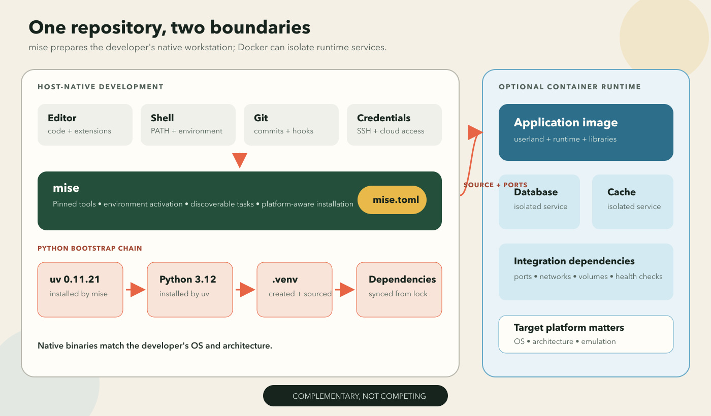
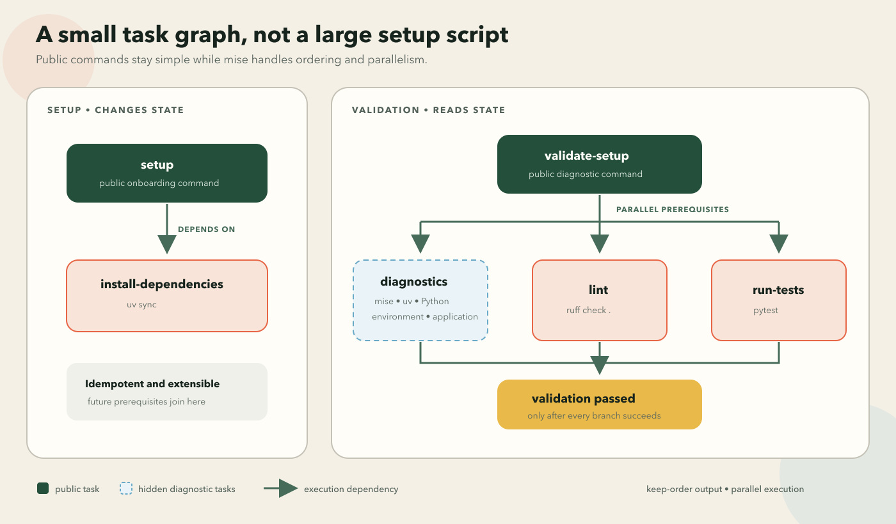

# A better first day in a Python repository with mise-en-place

You have just joined a team. You clone the backend repository, open the README,
and want to make a useful change before the end of the day.

Instead, the first hour becomes a scavenger hunt:

- Which Python version does this project use?
- How should I create and activate the virtual environment?
- Which package manager should I use?
- What runs the tests?
- Is the README still correct?
- Why does the application work for everyone except me?

None of these questions is difficult. That is what makes the situation annoying.
Every answer is usually written down somewhere, but a developer still has to
find it, interpret it, and reproduce it correctly.

Python setup can become a chain of small decisions:

- The system Python may be the wrong version or one we should not modify.
- The project may expect pyenv, asdf, Homebrew, or another installer.
- The virtual environment needs to be created and activated.
- Dependencies need the correct package manager and groups.
- Shell configuration decides which executable appears first on `PATH`.

Add macOS, Linux, Windows, Intel, and ARM machines, and a short setup note quietly
becomes a support matrix. A repository that works on one person's laptop is not
yet a repeatable development environment.

This is where [mise](https://mise.jdx.dev/) enters the picture. The name comes
from the culinary idea of *mise en place*: putting everything in place before
the real work begins. For a software project, mise combines three jobs that are
often spread across several tools and setup scripts:

- **Tool management:** install and select project-specific CLI and runtime
  versions.
- **Environment management:** load variables, paths, and virtual environments
  when the project becomes active.
- **Task running:** give setup, testing, linting, and development commands one
  discoverable interface.

mise is not Python-specific and does not replace uv, Docker, or every package
manager. It gives the repository one native, cross-platform entry point from
which those specialized tools can do their jobs.

That matches the contract I wanted: the repository should describe its
development ingredients as clearly as an image describes a runtime. For this
project, the first-day workflow becomes:

```bash
mise trust
mise install
mise run setup
mise run validate-setup
```

These commands install the declared tools, prepare the Python project, and
produce useful diagnostics when something does not work.

The complete example is the
[`tooling-demo`](https://github.com/harshvardhanjoshi14/tooling-demo) repository.
It is a small FastAPI service with a Click command-line interface, a `src/`
package layout, and tests. The application is intentionally modest. The
development experience is what we are examining.

## Before you start

mise is the only host prerequisite for this walkthrough. The repository's
[Install mise section](https://github.com/harshvardhanjoshi14/tooling-demo#install-mise)
is the live source for copy-paste setup instructions, including shell activation.
The [official getting-started guide](https://mise.jdx.dev/getting-started) covers
other platforms, package managers, and shells.

After installation and shell activation, verify mise before cloning the project:

```bash
mise --version
mise doctor
```

`mise doctor` checks the installation and highlights common shell or path
problems before they become project setup problems.

## Image-like, not image-based

Docker is an obvious answer to reproducible environments, and often the right
one. An image can package an operating-system userland, runtime, libraries, and
application into a versioned artifact. Development containers can also mount
source from the host so build tools stay inside the container
([Docker's development guide](https://docs.docker.com/get-started/workshop/06_bind_mounts/)).

But containers and native development tooling solve different boundaries:

- **Docker** packages an isolated runtime and its dependencies.
- **The host** still owns the editor, shell, Git client, credentials, filesystem,
  and often debugging tools.
- **Bind mounts** connect those environments and depend on host paths and the
  daemon host's filesystem
  ([Docker's bind-mount considerations](https://docs.docker.com/engine/storage/bind-mounts/#considerations-and-constraints)).
- **Multi-platform images** are supported, but must be built for the target
  platforms, cross-compiled, or run through emulation
  ([Docker's multi-platform documentation](https://docs.docker.com/build/building/multi-platform/)).

That machinery is valuable when the container is the product. It can be more
than I want just to give a developer the correct `uv` binary and a reliable
set of local commands.

The goal here is image-like but host-native. Docker can still run databases,
integration dependencies, or the eventual application image. mise prepares the
workstation layer outside those containers.



## Why not Make and Homebrew?

A Makefile can provide a good command interface. GNU Make is familiar, common
on Unix-like machines, and excellent at dependency ordering and rebuilding only
what changed ([GNU Make](https://www.gnu.org/software/make/)).

The tradeoff appears when it also becomes the installer:

- Make recipes run shell commands.
- Cross-platform installation requires OS, architecture, and shell branches.
- The repository owns that portability logic and its maintenance.

The [GNU Make manual](https://www.gnu.org/software/make/manual/html_node/Recipes.html)
is explicit that recipes are interpreted by a shell. That is precisely where
many workstation differences surface.

[Homebrew Bundle](https://docs.brew.sh/Brew-Bundle-and-Brewfile) can declaratively
install project dependencies and is a useful option on macOS and Linux. It is
still centered on one package manager. Once a project needs other registries,
project-specific activation, environment variables, and a task graph, we start
composing Brew, Make, and shell configuration ourselves.

mise is designed for that composition:

- Its [backends](https://mise.jdx.dev/dev-tools/backends/) install tools from
  ecosystems including Aqua, GitHub Releases, Cargo, npm, and pipx.
- Its environment support places project tools and variables in the shell.
- Its task runner gives the repository one discoverable command interface.

It does not replace every specialized tool. It removes a useful amount of glue
between them.

## The ownership model

That short introduction hides a useful lifecycle. When mise's shell integration
enters a directory, it discovers configuration, checks trust and minimum-version
requirements, resolves tools for the current platform, and constructs the
project environment.

In this repository, ownership is explicit:

- **mise** installs a pinned uv version, sources `.venv`, and exposes tasks.
- **uv** installs Python, creates `.venv`, and manages Python dependencies.
- **The package CLI** owns how the application itself runs.

```text
mise -> uv 0.11.21 -> Python 3.12.13 -> .venv -> project dependencies
```

There is no reason for mise and uv to manage the same Python installation.

## Pin the bootstrap tool

The repository starts `mise.toml` with a minimum mise version and one tool:

```toml
min_version = "2026.6.10"

[tools]
uv = "0.11.21"
```

The minimum version prevents an older mise release from guessing how to handle
unsupported configuration. The uv pin ensures developers do not get different
behavior because they installed the project months apart.

For now, one tool is enough. I would rather add tools when the repository needs
them than turn `mise.toml` into a collection of things that look useful.

## Let uv own Python

The concrete development interpreter lives in `.python-version`:

```text
3.12.13
```

The supported range remains package metadata in `pyproject.toml`:

```toml
[project]
requires-python = ">=3.12"
```

The distinction is small but useful:

- `requires-python` describes which Python versions the project supports.
- `.python-version` selects the interpreter used to develop this checkout.

When `uv sync` runs, uv respects `.python-version`. It can download a missing
interpreter, create `.venv`, resolve dependencies, and install the project as
editable. The details live in uv's guides to
[Python versions](https://docs.astral.sh/uv/concepts/python-versions/) and
[project synchronization](https://docs.astral.sh/uv/concepts/projects/sync/).

Only mise needs to be installed before entering the repository.

## Make the environment disappear

Creating a virtual environment is only half the job. Developers also need tools
to use it consistently.

```toml
[settings]
python.uv_venv_auto = "create|source"
task.output = "keep-order"

[env]
_.python.venv = { path = ".venv" }
```

This configuration links the pieces:

- `create|source` lets the uv integration create the environment when needed
  and source it when present.
- The `[env]` directive identifies `.venv` as the project environment.
- `keep-order` keeps parallel task output readable later.

With a committed `uv.lock`, `mise install` may leave a fresh checkout looking
fully prepared. mise installs uv, uv can create the environment, and mise sources
it. I still keep `mise run setup` as an explicit contract. It is idempotent,
makes dependency synchronization intentional, and gives future setup operations
a stable home.

Because project configuration can affect the shell and run commands, it must be
trusted once:

```bash
mise trust
```

Trust is explicit and local. mise does not blindly evaluate a newly cloned
configuration. See the [`mise trust` reference](https://mise.jdx.dev/cli/trust.html)
for the exact behavior.

## Give the repository executable commands

The smallest setup operation is deliberately boring:

```toml
[tasks.install-dependencies]
description = "Install the project dependencies"
run = "uv sync"

[tasks.setup]
description = "Install the development environment"
depends = ["install-dependencies"]
```

The extra task layer gives us useful properties:

- `install-dependencies` is small, direct, and safe to rerun.
- `setup` is the stable public entry point.
- Future idempotent prerequisites can join the graph without changing onboarding.
- `depends` lets independent prerequisites run concurrently.
- A `run` array is available when steps require strict sequential ordering.

The daily workflow follows the same pattern:

```toml
[tasks.start-dev-server]
description = "Run the API with automatic reloads"
run = "uv run tooling-demo serve --reload"

[tasks.run-tests]
description = "Run the test suite"
run = "uv run pytest"

[tasks.lint]
description = "Check the codebase with Ruff"
run = "uv run ruff check ."

[tasks.format]
description = "Format the codebase with Ruff"
run = "uv run ruff format ."
```

Descriptions turn configuration into help:

```bash
mise tasks
```

```text
format                Format the codebase with Ruff
install-dependencies  Install the project dependencies
lint                  Check the codebase with Ruff
run-tests             Run the test suite
setup                 Install the development environment
start-dev-server      Run the API with automatic reloads
start-server          Run the API
validate-setup        Print diagnostics and validate the development setup
```

> **Media placeholder:** Screenshot of `mise tasks` showing the public tasks
> and descriptions.

The full task surface includes arguments, dependencies, platform-specific
variants, and file-based tasks
([mise task configuration](https://mise.jdx.dev/tasks/task-configuration.html)).

## Keep application commands in the application

The repository task is convenient:

```bash
mise run start-dev-server
```

Underneath it, the installed package owns the real command:

```bash
uv run tooling-demo serve --reload
```

This boundary keeps both interfaces useful:

- Package users get a normal CLI.
- Repository contributors get one command surface for setup, tests, and runtime.

## Validate setup, do not just hope

Setup changes the environment. Validation inspects it:

```bash
mise run validate-setup
```

The aggregate task depends on diagnostics, linting, and tests:

```toml
[tasks.validate-setup]
description = "Print diagnostics and validate the development setup"
depends = [
    "diagnose-mise",
    "diagnose-uv",
    "diagnose-python",
    "diagnose-environment",
    "diagnose-application",
    "lint",
    "run-tests",
]
run = 'echo "Setup validation passed."'
```

Independent dependencies run in parallel. If any branch fails, the success
message does not run. `task.output = "keep-order"` buffers those branches so
the report remains readable.



The diagnostic helpers are hidden from the default task list but remain directly
callable. Together they report:

- mise, uv, and Python versions;
- active executable paths;
- installed packages and compatibility;
- application metadata;
- lint and test results.

The output provides confidence when setup works and a useful report to share
when it does not.

## The development loop is still manual

Every quality check now has a stable command:

```bash
mise run format
mise run lint
mise run run-tests
```

That is already better than remembering tool-specific flags. A developer can
also run the smallest useful check while working instead of waiting for the
entire suite.

Someone still has to remember to run the commands. In a later article,
[prek](https://prek.j178.dev/) will call the relevant checks at the commit
boundary. The manual tasks remain useful for fast feedback; the hook becomes a
safety net, not a replacement.

## The complete first run

With mise installed and activated:

```bash
git clone https://github.com/harshvardhanjoshi14/tooling-demo.git
cd tooling-demo

mise trust
mise install
mise run setup
mise run validate-setup
mise tasks
mise run start-dev-server
```

The API is available at `http://127.0.0.1:8000`, with FastAPI's interactive
documentation at `http://127.0.0.1:8000/docs`.

> **Media placeholder:** Short terminal recording from a fresh clone through
> setup validation, followed by opening the FastAPI documentation.

## Things to explore

The repository only uses a small part of mise. A few useful exercises:

1. Run `mise config ls`, `mise ls --current`, and `mise env` to inspect how
   configuration becomes an active environment.
2. Run `mise tasks deps --dot validate-setup` and render the result with
   Graphviz to inspect the task graph.
3. Compare `mise run validate-setup` with
   `mise run -j 1 validate-setup` to see parallel and sequential execution.
4. Add one platform-independent CLI to `[tools]`, pin it, and add a hidden
   diagnostic task. The public setup interface should not need to change.
5. Explore task
   [`sources` and `outputs`](https://mise.jdx.dev/tasks/task-configuration.html#sources--outputs)
   to skip work when inputs have not changed.
6. Compare the exact uv pin with an optional
   [`mise.lock`](https://mise.jdx.dev/dev-tools/mise-lock.html).

## What remains unsolved

This repository is not finished, and that is useful.

We do not yet guarantee that a dependency edit includes the corresponding
`uv.lock` update. Checks do not run automatically before commits, and no CI
workflow proves that local commands behave the same way on a clean machine.

Those are the next problems:

1. Examine uv's project and dependency workflow in more depth.
2. Add prek for fast checks and lockfile validation before commits.
3. Add CI that calls the same repository-owned tasks.
4. Introduce Conventional Commits, Commitizen, and changelog generation.
5. Turn the accumulated structure into a reusable project template.

For this first pass, the result is intentionally small:

- one pinned bootstrap tool;
- one Python version declaration;
- an automatically managed environment;
- a command surface discoverable without archaeology.

That is enough to turn the first hour in a repository back into engineering.

## Acknowledgements and further reading

This setup stands on work by people who have already spent a great deal of time
making development environments less surprising:

- The
  [`tooling-demo` README](https://github.com/harshvardhanjoshi14/tooling-demo#readme)
  is the maintained setup reference for the example used throughout the article.
- [mise](https://mise.jdx.dev/) and its
  [contributors](https://github.com/jdx/mise/graphs/contributors) provide the
  tool manager, environment integration, and task runner. Continue with its
  [getting-started guide](https://mise.jdx.dev/getting-started),
  [shell activation reference](https://mise.jdx.dev/cli/activate.html),
  [`mise doctor` reference](https://mise.jdx.dev/cli/doctor.html),
  [tool installation reference](https://mise.jdx.dev/cli/install.html),
  [configuration guide](https://mise.jdx.dev/configuration.html), and
  [task documentation](https://mise.jdx.dev/tasks/).
- [uv](https://docs.astral.sh/uv/) from Astral manages Python, the environment,
  and project dependencies. Its documentation on
  [Python versions](https://docs.astral.sh/uv/concepts/python-versions/) and
  [project synchronization](https://docs.astral.sh/uv/concepts/projects/sync/)
  explains the behavior used here.
- Docker's guides to
  [development containers](https://docs.docker.com/get-started/workshop/06_bind_mounts/)
  and [multi-platform builds](https://docs.docker.com/build/building/multi-platform/)
  help clarify when host-native tools, containers, or both fit a project.
- [GNU Make](https://www.gnu.org/software/make/) and
  [Homebrew Bundle](https://docs.brew.sh/Brew-Bundle-and-Brewfile) remain useful
  alternatives and informed the tradeoffs discussed here.
