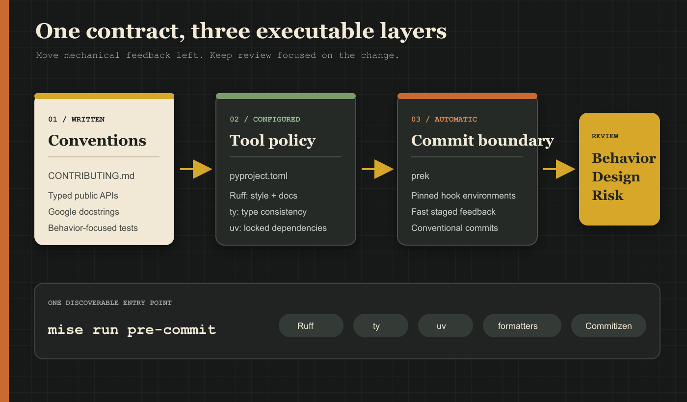
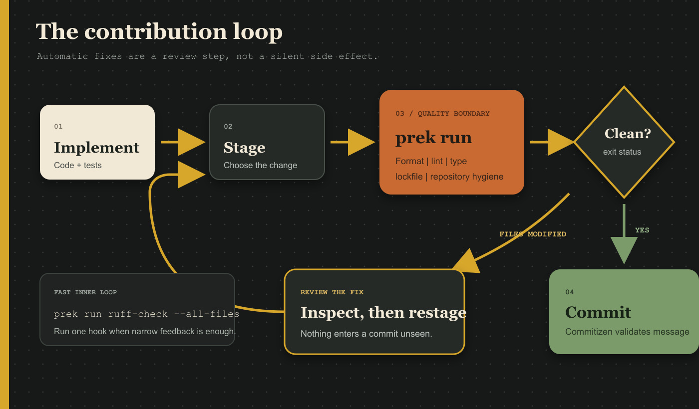
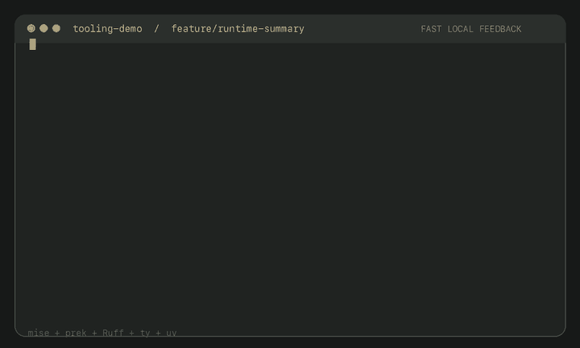

# Stop reviewing whitespace: consistent Python contributions with prek


On my first day in this repository, I was asked to make a small change.

Before touching the application, I wanted a development environment I could
reproduce without assembling Python, virtual environments, and project commands
by hand. That became the first iteration of
[`tooling-demo`](https://github.com/harshvardhanjoshi14/tooling-demo): mise
installed the tools, uv built the environment, and a small task graph made the
workflow discoverable.

Now the environment works. I can start contributing.

That creates the next problem.

How do we make sure contributions follow the same standards without turning
every pull request into a conversation about import ordering, indentation,
docstrings, or somebody's preferred formatter?

## A working environment is only the first contract

Easy setup gets a contributor to the code. It does not tell them what a good
change looks like.

A useful contribution contract needs three layers:

- **Written conventions** explain what the project values and why.
- **Executable configuration** turns objective rules into repeatable checks.
- **Automatic enforcement** runs those checks before review.

The first layer now lives in `CONTRIBUTING.md`. It keeps the expectations small:

- use modern Python 3.12;
- write typed functions with focused responsibilities;
- document public contracts using Google-style docstrings;
- structure tests around Given, When, Then;
- test behavior rather than implementation details;
- keep commits focused and use Conventional Commits.

Some judgment will always remain with the engineer and reviewer. A tool cannot
decide whether a function has the right responsibility or whether a docstring
is genuinely helpful.

It can remove the mechanical debates.

## Put the objective rules in the repository

The repository already had commands for Ruff and pytest:

```bash
mise run format
mise run lint
mise run run-tests
```

They were useful, but somebody still had to remember to run them. They also left
room for new checks to accumulate as unrelated commands.

The replacement is one quality boundary:

```bash
mise run pre-commit
```

That command is repository-owned. It runs the same way for each contributor and
will later become part of CI.

The individual tools still exist. When I only want Ruff feedback, I can run a
single hook:

```bash
prek run ruff-check --all-files
```

The aggregate is the contract; targeted commands are the fast inner loop.

## The configuration is familiar; the runner is new

[pre-commit](https://pre-commit.com/) defines a widely used configuration model
for repository hooks. A `.pre-commit-config.yaml` file selects hook repositories,
pins revisions, filters files, and maps checks to Git hook stages.

I kept that familiar file format, but run it with
[prek](https://prek.j178.dev/).

Prek is a Git hook manager written in Rust and designed as a drop-in alternative
to pre-commit. It is distributed as a single binary, understands existing
pre-commit configurations, prepares isolated hook environments, and provides
Rust-native fast paths for several common hooks.

That compatibility matters. Adopting a faster runner does not require inventing
a private hook ecosystem or rewriting a configuration that many Python
engineers already recognize.

Mise installs a pinned prek version alongside uv:

```toml
[tools]
prek = "0.3.9"
uv = "0.11.22"
```

The setup workflow also grows organically. It now installs dependencies and
prepares both the `pre-commit` and `commit-msg` Git hooks in parallel, then
prints its completion message:

```toml
[tasks.install-git-hooks]
description = "Install and prepare the repository Git hooks"
run = "prek install --prepare-hooks"

[tasks.setup]
description = "Install the development environment"
run = [
  { tasks = ["install-dependencies", "install-git-hooks"] },
  'echo "Development environment is ready."',
]
```

The project configuration declares both Git stages:

```yaml
default_install_hook_types:
  - pre-commit
  - commit-msg
```

`mise run setup` remains the onboarding command even as the work behind it
evolves.



## Give every tool a clear boundary

The hook list is sizeable, but it is easier to understand when grouped by the
problem each tool owns.

### Repository hygiene

The standard
[`pre-commit-hooks`](https://github.com/pre-commit/pre-commit-hooks) repository
catches inexpensive mistakes early:

- unexpectedly large files;
- malformed TOML or YAML;
- missing final newlines and mixed line endings;
- executable files without shebangs;
- known AWS credentials;
- inconsistent JSON formatting;
- trailing whitespace;
- direct commits to `main`.

These are not substitutes for security scanning or server-side branch
protection. They are fast feedback for common local mistakes.

### Configuration formatting

Different TOML files have different owners:

- [pyproject-fmt](https://github.com/tox-dev/pyproject-fmt) formats
  `pyproject.toml` while preserving our full dependency versions.
- [Tombi](https://github.com/tombi-toml/tombi-pre-commit) formats the other
  handwritten TOML files.
- uv owns the generated `uv.lock`, so Tombi explicitly excludes it.
- [yamlfmt](https://github.com/jumanjihouse/pre-commit-hook-yamlfmt) applies the
  repository's two-space YAML style and 100-column width.

That last distinction is important. A generic formatter can understand a
generated file without owning it. Formatting `uv.lock` created a large,
whitespace-only diff during setup, so the hook boundary was corrected rather
than accepting permanent noise.

### Python linting and formatting

[Ruff](https://docs.astral.sh/ruff/) replaces a collection of separate Python
tools with one Rust-based linter and formatter. Its policy lives in
`pyproject.toml`, not in editor-specific settings or shell aliases.

The selected rules cover areas traditionally handled by Flake8 plugins, isort,
pyupgrade, pydocstyle, and Ruff's own checks. The complete policy remains in the
repository; these are the additions that make the written contribution guide
executable:

```toml
[tool.ruff]
target-version = "py312"
line-length = 88

[tool.ruff.lint]
select = [
  "ANN", # flake8-annotations
  "D",   # pydocstyle
]

[tool.ruff.lint.pydocstyle]
convention = "google"
```

Tests remain typed, but they do not need docstrings that repeat descriptive test
names:

```toml
lint.per-file-ignores."tests/**/*.py" = ["D", "S101"]
```

Ruff's lint hook runs with `--fix` before the formatter. A lint fix can change
code that then needs formatting, so this order is deliberate.

### Type checking with ty

Annotations are useful only if they describe how values actually move through
the program.

[ty](https://docs.astral.sh/ty/) is an extremely fast Python type checker and
language server written in Rust. It is currently beta, so the repository pins
the version as a development dependency:

```toml
[dependency-groups]
dev = [
  "ty==0.0.40",
]
```

Ty does not yet provide an official pre-commit hook. The integration is a small,
transparent local hook:

```yaml
- repo: local
  hooks:
    - id: ty-check
      name: ty check
      entry: uv run ty check
      language: system
      pass_filenames: false
```

`pass_filenames: false` is intentional. Type relationships cross file
boundaries, so ty checks the project rather than only the Python files staged in
one commit.

Ruff and ty have separate jobs:

- Ruff requires annotations and enforces code conventions.
- ty verifies that the annotated program is type-consistent.

### Dependency and commit integrity

The official uv hook runs `uv-lock`, preventing a dependency edit from being
committed without its corresponding lockfile update.

[Commitizen](https://commitizen-tools.github.io/commitizen/) runs at the
`commit-msg` stage and validates Conventional Commits. For now, that gives the
history a predictable structure. The next article will use that structure to
generate a changelog.

## Use the contract on a real change

With the quality boundary in place, I can return to the small feature: expose
information about the Python runtime hosting the service.

First, work away from `main`:

```bash
git switch -c feature/runtime-diagnostics
```

The library adds a typed response model and function:

```python
class RuntimeInfo(BaseModel):
    """Information about the Python runtime hosting the service."""

    python_implementation: str
    python_version: str


def get_runtime_info() -> RuntimeInfo:
    """Return information about the active Python runtime.

    Returns:
        RuntimeInfo: The Python implementation and version running the service.
    """
    return RuntimeInfo(
        python_implementation=platform.python_implementation(),
        python_version=platform.python_version(),
    )
```

The same behavior is exposed through two interfaces:

```text
GET /runtime
tooling-demo runtime
```

The service-level test keeps Given, When, Then visible without adding ceremony:

```python
def test_get_runtime_info(monkeypatch: pytest.MonkeyPatch) -> None:
    monkeypatch.setattr("platform.python_implementation", lambda: "CPython")
    monkeypatch.setattr("platform.python_version", lambda: "3.12.0")

    runtime = get_runtime_info()

    assert runtime == RuntimeInfo(
        python_implementation="CPython",
        python_version="3.12.0",
    )
```

There are also API and CLI tests because those are public boundaries, not just
thin files that happen to call the library.

## The first hook run is allowed to fail

After implementing the feature:

```bash
mise run pre-commit
```

The first run fixed an import and exited unsuccessfully because a hook modified
a file. That is expected behavior. Silently changing staged code and continuing
the commit would make the commit contain something I had not reviewed.

The loop is:

1. Run the hooks.
2. Review automatic fixes.
3. Stage the corrected files.
4. Run the hooks again.
5. Commit when the boundary is clean.



The second run passed Ruff, ty, uv, formatting, repository hygiene, and branch
protection. The test suite grew from four tests to seven.

The commit message then passed the separate `commit-msg` hook:

```text
feat: expose runtime diagnostics
```



## What this changes in review

Hooks do not make code correct, and a style guide does not remove the need for
judgment.

They do move predictable work earlier:

- formatting happens before a pull request;
- type errors are found near the edit;
- dependency metadata and the lockfile move together;
- accidental credentials and malformed configuration receive immediate
  feedback;
- commit messages form useful project history;
- reviewers can spend more time on behavior, design, and operational risk.

The result is not merely faster commands. Rust-based tools such as prek, Ruff,
uv, and ty reduce startup cost, glue code, and the number of separate Python
utilities a contributor must understand.

That is the useful tradeoff: Python remains the application language while Rust
quietly improves the development loop around it.

## What remains unsolved

Local hooks can be bypassed, and local success does not prove that a clean
machine sees the same result.

The next iteration will:

1. Run the repository-owned quality checks and tests in CI.
2. Protect the default branch with server-side status checks.
3. Use Conventional Commits to generate a changelog.
4. Connect versioning, release notes, and the release workflow.

The local contract now exists. The next job is to make the remote repository
enforce it.

## Acknowledgements and further reading

- [tooling-demo repository](https://github.com/harshvardhanjoshi14/tooling-demo)
- [prek documentation](https://prek.j178.dev/)
- [prek configuration compatibility](https://prek.j178.dev/configuration/)
- [pre-commit documentation](https://pre-commit.com/)
- [pre-commit hooks](https://github.com/pre-commit/pre-commit-hooks)
- [Ruff documentation](https://docs.astral.sh/ruff/)
- [Ruff pre-commit integration](https://github.com/astral-sh/ruff-pre-commit)
- [ty documentation](https://docs.astral.sh/ty/)
- [uv pre-commit integration](https://docs.astral.sh/uv/guides/integration/pre-commit/)
- [pyproject-fmt](https://github.com/tox-dev/pyproject-fmt)
- [Tombi pre-commit integration](https://github.com/tombi-toml/tombi-pre-commit)
- [Commitizen commit checking](https://commitizen-tools.github.io/commitizen/tutorials/auto_check/)
- [Conventional Commits](https://www.conventionalcommits.org/en/v1.0.0/)
